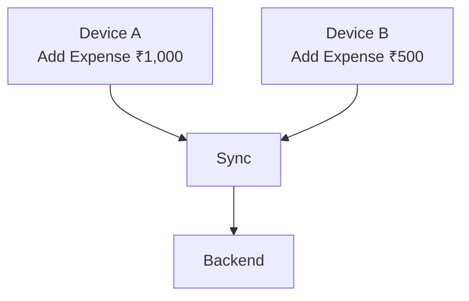
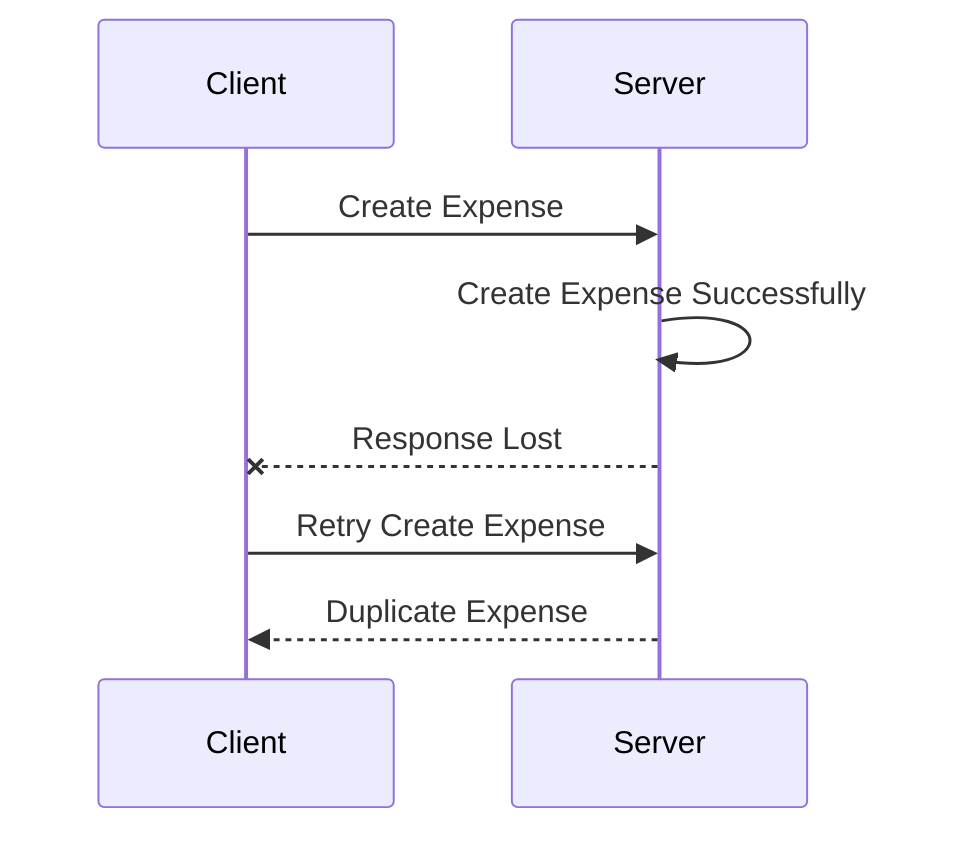

# 01. Requirements

## Problem Statement

Design an expense-sharing application that allows users to create groups, record shared expenses, split expenses among participants, track individual balances, and settle outstanding amount.

The system should work for small groups such as roommates, travel friends, and family trips, while also supporting large collaborative groups with frequent updates and occasional network loss.

The system should maintain correct financial balances even when multiple users modify the same group or expense concurrently.

## Functional Requirements

### User Management

- User can register and log in.

- User can view and update their profile.

- User can search for other users.

- User can add/remove friends.

- User can view their friends.

### Group Management

- User can create a group.

- User can update group details.

- User can delete/leave a group.

- User can add members to a group.

- User can remove members from a group.

- User can view group members.

- User can view all expenses belonging to a group.

- User can view the current balance of each member.
  
### Expense Management

Users should be able to:

- Add an expense.

- Edit an expense.

- Delete an expense.

- View expense details.

- View expense history.

- Specify who paid.

- Specify expense amount.

- Specify expense description.

- Specify expense date/time.

- Specify expense participants.

### Expense Splitting

The system should support different split types:

#### Equal Split
₹3,000 / 3 people

Vikas → ₹1,000

Rahul → ₹1,000

Amit  → ₹1,000
#### Exact Amount
Vikas → ₹1,500

Rahul → ₹900

Amit  → ₹600
#### Percentage
Vikas → 50%

Rahul → 30%

Amit  → 20%

The system should validate that the split amounts add up to the total expense.

### Balance Management
- Calculate each member's net balance.

- Show how much each user owes.

- Show how much each user is owed.

- Show group-level balances.

- Show overall balances across groups.

- Minimize the number of settlement transactions where appropriate.

Example:

Vikas owes Rahul     ₹500

Amit owes Vikas      ₹300

Rahul owes Amit      ₹200

The system may simplify this to:

Vikas → Rahul    ₹300

Amit  → Rahul    ₹200

### Settlement
- User can record a settlement.

- User can view settlement history.

- User can mark an outstanding amount as settled.

- System should update balances after settlement.

### Offline Support

Users should be able to:

- View previously synchronized groups and expenses offline.
- Create expenses while offline.
- Edit locally available expenses while offline.
- Record settlement actions while offline.
- Queue local changes for synchronization.
- Automatically synchronize changes when connectivity is restored.

### Synchronization

When connectivity becomes available:

Local Changes
     ↓
Sync Queue
     ↓
Backend
     ↓
Conflict Detection
     ↓
Conflict Resolution
     ↓
Updated Server State
     ↓
Local Database
     ↓
UI

The system should prevent duplicate operations when a request is retried.

## Non-Functional Requirements

### Consistency

Financial information must be correct.

For example:

Total Expense = ₹3,000

Participant Shares:
₹1,000 + ₹1,000 + ₹1,000

Expected Total = ₹3,000

The system must not accidentally create or lose money because of concurrent updates, retries, or synchronization conflicts.

### Availability

The application should remain useful when the backend is temporarily unavailable.

Previously synchronized data should remain accessible offline.

Users should be able to create local changes even when the network is unavailable.

### Performance

Typical operations should respond quickly.

Examples:

Open group              → fast local response
View expense history    → paginated
Create expense          → immediate local UI update
Sync changes            → asynchronous

The application should avoid blocking the UI while performing network synchronization.

### Reliability

The system should handle:

- Network failures
- Request timeouts
- Server errors
- Duplicate requests
- Application restarts
- Device restarts
- Interrupted synchronization
- Partial synchronization
- Concurrent modifications
  
### Scalability

The backend should support growth in:

Users
Groups
Expenses
API requests
Synchronization operations
Settlement operations

The architecture should allow individual backend components to scale independently where required.

### Offline Capability

The mobile application should support an offline-first experience for core expense-management operations.

Local data should be treated as the primary source for the UI where appropriate, while synchronization reconciles local and server state.

### Data Durability

Expense and settlement data should not be lost because of:

- Network failures
- App crashes
- Device restarts
- Server failures
- Retry operations

### Security

The system should protect:

User accounts
Authentication credentials/tokens
Financial information
Personal information
Group membership information

Users should only be able to access resources they are authorized to access.

### Observability

The backend should provide sufficient observability to detect:

- Failed synchronization
- API failures
- Increased latency
- Database failures
- Queue backlogs
- Authentication failures
- Unexpected financial inconsistencies

## Assumptions & Constraints

### Assumptions
- A user can belong to multiple groups.
- A group can contain multiple users.
- An expense belongs to one group.
- An expense can have multiple participants.
- One or more users can contribute toward an expense.
- Expenses are represented using a supported currency.
- The backend is the authoritative source for synchronized data.
- The mobile application maintains a local database for offline access.
- Network connectivity may be unavailable or unreliable.
- Multiple users can modify the same group concurrently.
- Users can use multiple devices.
- The same operation may be retried because of network failures.

### Constraints
#### Financial Precision

Monetary values should not rely on floating-point arithmetic.

Prefer:

₹100.50 → 10050 paise

rather than:

100.50 → floating-point value

This avoids precision problems when calculating balances.

### Concurrent Updates

Two or more users may modify related data simultaneously.

For example, two devices may add expenses at nearly the same time:

The system must define how concurrent changes are processed and reconciled.

Possible approaches include:

- **Last Write Wins** — The latest update overwrites the previous update.
- **Version-based Conflict Resolution** — Each entity has a version number, and conflicting updates are detected.
- **Server-side Reconciliation** — The backend determines how multiple updates should be merged.
- **Optimistic Concurrency Control** — Updates are accepted only if the entity version has not changed since it was read.

The appropriate strategy depends on the type of data and the business requirements.

#### Offline Changes

A user may create multiple changes before synchronization:

10:00 → Add expense
10:05 → Edit expense
10:10 → Add another expense
10:15 → Network restored

The synchronization mechanism must preserve the correct ordering and final state.

#### Duplicate Requests

A request may succeed on the server, but the client may not receive the response due to a network failure.

The client may retry the request, which can result in a duplicate expense if the server does not handle idempotency.

#### Conflict Resolution

Conflicts may occur when the same entity is modified from different devices or by different users.

The system must define conflict-resolution rules rather than blindly using the latest received update.